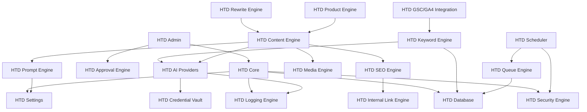

# MODULE DEPENDENCY GRAPH

```mermaid
flowchart TD
    Core[HTD Core] --> DB[HTD Database]
    Core --> Settings[HTD Settings]
    Core --> Security[HTD Security Engine]
    Core --> Log[HTD Logging Engine]
    Admin[HTD Admin] --> Core
    Admin --> Approval[HTD Approval Engine]
    Providers[HTD AI Providers] --> Vault[HTD Credential Vault]
    Providers --> Log
    Prompt[HTD Prompt Engine] --> Settings
    Keyword[HTD Keyword Engine] --> DB
    Keyword --> Providers
    Content[HTD Content Engine] --> Prompt
    Content --> Providers
    Content --> Media[HTD Media Engine]
    Content --> SEO[HTD SEO Engine]
    Rewrite[HTD Rewrite Engine] --> Content
    Product[HTD Product Engine] --> Content
    SEO --> Link[HTD Internal Link Engine]
    Queue[HTD Queue Engine] --> DB
    Scheduler[HTD Scheduler] --> Queue
    Scheduler --> Security
    GSC[HTD GSC/GA4 Integration] --> Keyword
```
